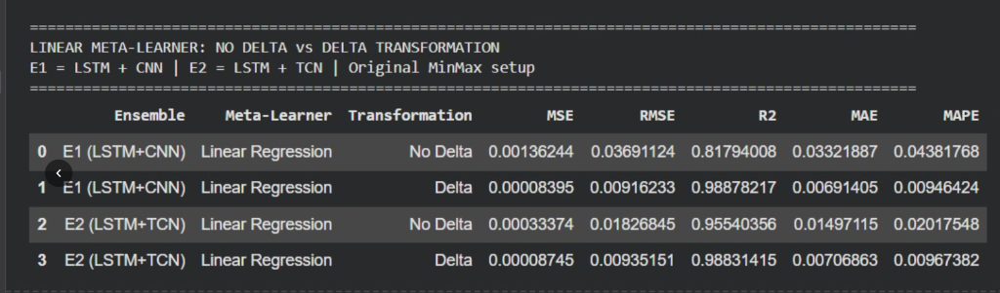
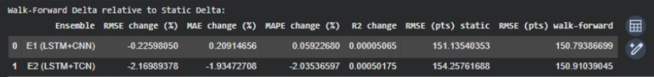
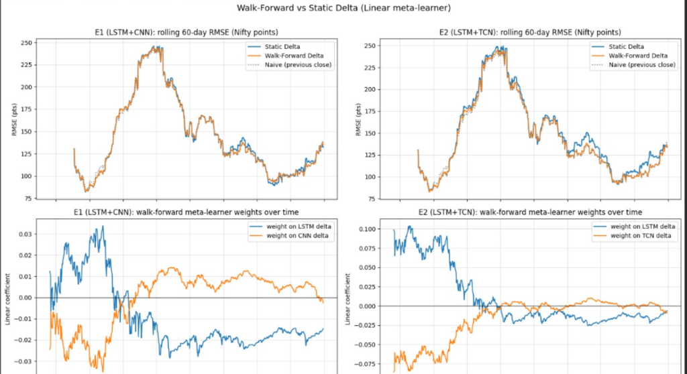

<div align="center">

# 🚀 NIFTY-50 Delta-Meta Forecaster
**A Delta-Transformation-Based Meta-Learning Hybrid Ensemble Framework**

[](https://www.python.org/)
[](https://tensorflow.org)
[](https://github.com/skandanadig/delta-meta-ensembles/actions)
[](#-publications--acknowledgements)
[](https://opensource.org/licenses/MIT)

*An advanced, publication-grade deep learning architecture designed to tackle the volatile, non-linear, and non-stationary nature of the NIFTY-50 financial index.*

</div>

---

## 🌟 Project Overview

Welcome to the **NIFTY-50 Delta-Meta Forecaster**! 

Stock price prediction is a formidable challenge, especially when financial indices trend aggressively into unprecedented highs or lows (distribution shifts). Traditional stacked ensembles and sequence models often fail in these scenarios, suffering from severe extrapolation errors and lagging the market.

**Our Core Innovation:** We mapped the entire forecasting problem into **Delta-Space**! 🌌

### 🔬 The Delta-Transformation Advantage
Instead of forcing our models to guess absolute, non-stationary price levels, our base learners predict *the change relative to the previous day* (the delta). 

1. **Stationary Bounds:** By predicting deltas, the target variable is mathematically restricted into a stationary distribution.
2. **Eliminating Extrapolation Failure:** Meta-learners no longer have to guess price levels they have never seen during training. They operate purely on familiar, bounded delta ranges.
3. **No More Lag:** The final reconstructed price series actively tracks turning points and momentum rather than merely smoothing out the trend.

---

## 🏆 Key Highlights & Results

> [!IMPORTANT]
> **The Winner:** The **E2 (LSTM + TCN)** ensemble paired with a **Random Forest meta-learner** achieved a massive **~48.7% reduction in RMSE** compared to the best standalone base model (CNN).

- 📉 **RMSE:** `0.009108` (MinMax scaled)
- 🎯 **$R^2$ Score:** `0.98892`
- 🎯 **MAPE:** `0.942%`
- 💡 **Architectural Finding:** In delta-space, shallow linear models and tree-ensembles consistently outperformed highly complex gradient boosting and neural networks, proving that the **delta-transformation itself is the true driver of accuracy!**

### 🧪 No Delta vs Delta Transformation
We performed an ablation study comparing the performance of meta-learners with and without the Delta Transformation. The results clearly demonstrate that transforming the data into Delta-Space significantly improves metrics across the board (MSE, RMSE, R2, MAE, MAPE).



### 🧪 Walk-Forward vs Static Delta Analysis
We also tested a walk-forward optimization approach for the delta meta-learner versus a static delta approach. We found that the errors are negligible between the two, indicating that the static delta approach is highly robust over time.



**Walk-Forward vs Static Delta Reconstruction:**


**Final Reconstruction Visualization:**


---

## 🚀 Interactive Notebooks

You can explore the code and run the models directly in Google Colab:
- [Previous Version (Initial Setup & Exploration)](https://colab.research.google.com/drive/1645Yj1u76I2qkI8xb82Mr2gnyR6VAaqH)
- [Version After 3 Reviews (Final Version with Additional Tests)](https://colab.research.google.com/drive/1645Yj1u76I2qkI8xb82Mr2gnyR6VAaqH#scrollTo=9YHULAkwd4ZB)

---

## 🧠 The Hybrid Ensemble Architecture

Our framework is built on a heterogeneous **two-layer stacked ensemble**:

```text
             NIFTY-50 Prices
                    ↓
             Delta Transform
                    ↓
        ┌───────────┼───────────┐
       LSTM        CNN         TCN
        └───────────┼───────────┘
                    ↓
              Meta Features
                    ↓
          Meta-Learner Ensemble
                    ↓
             Price Forecast
```

### Layer 1: The Base Learners
- 🌀 **LSTM:** Captures long-term sequential dependencies.
- 🖼️ **CNN:** Extracts local geometric and structural patterns.
- 🕰️ **TCN:** Leverages dilated causal convolutions for mapping long-range dependencies.

### Layer 2: The Meta-Learners
We evaluated **13 different meta-learners** in delta-space (Random Forest, XGBoost, Ridge, Stacking Regressors) to find the perfect synergistic correction layer.

---

## 📂 Repository Structure

The project has been architected as a professional, reproducible ML software system:

```text
📦 nifty50-forecasting
 ┣ 📂 configs               # YAML configs for hyperparameters (epochs, LR, windows)
 ┣ 📂 data                  
 ┃ ┣ 📂 raw                 # Downloaded dataset
 ┃ ┗ 📂 processed           # Transformed & scaled data arrays
 ┣ 📂 notebooks             
 ┃ ┗ 📜 01_exploration.ipynb # Initial data exploration & prototyping
 ┣ 📂 paper                 # Standalone research manuscript PDF
 ┣ 📂 results               
 ┃ ┣ 📜 metrics.csv         # Computed evaluation metrics
 ┃ ┣ 📜 model_comparison.csv# Comprehensive ablation results
 ┃ ┗ 📂 figures             # Saved evaluation plots and prediction tracking charts
 ┣ 📂 src                   
 ┃ ┣ 📂 models              # Base & Meta models (LSTM, CNN, TCN, Meta)
 ┃ ┣ 📜 data.py             # Data fetching pipelines
 ┃ ┣ 📜 preprocessing.py    # Scaling & windowing
 ┃ ┣ 📜 features.py         # Delta-transformation logic
 ┃ ┣ 📜 train.py            # Main execution pipeline
 ┃ ┗ 📜 evaluate.py         # Scoring metrics
 ┣ 📂 tests                 # Unit tests (pytest)
 ┣ 📜 README.md             
 ┣ 📜 pyproject.toml        # Package & dependency definitions
 ┗ 📜 requirements.txt      
```

---

## 🚀 Reproducibility & Getting Started

**1. Clone the repository**
```bash
git clone https://github.com/skandanadig/delta-meta-ensembles.git
cd delta-meta-ensembles
```

**2. Install Dependencies**
We provide both a `requirements.txt` and a `pyproject.toml` for modern tooling.
```bash
pip install -r requirements.txt
# OR install as a package:
pip install -e .[dev]
```

**3. Run the Pipeline!**
The entire pipeline is configurable. Simply pass a YAML config to the training script:
```bash
python -m src.train --config configs/ensemble.yaml
```

**4. Run the Unit Tests**
Ensure the data logic and delta transformations are correct:
```bash
pytest tests/
```

---

## 🎓 Publications & Acknowledgements

This research was conducted as an internship project at the **Center for Cloud Computing and Big Data (CCBD), PES University**.

> 🎉 **Publication Accepted!**  
> This paper has been officially accepted for presentation at **The International Conference on Intelligent Networks and Data-driven Intelligent Applications (ICon INDIA 2026)**, scheduled for **20–22 November 2026 in Puducherry, India**.

### 👥 Contributors
- **Skanda Shyam Nadig** - *PES University*
- **Sharat Doddihal** - *PES University*
- **Shishir Hegde** - *PES University*
- **Shree Verdhan M** - *PES University*
- **Dr. Nagegowda K S** - *Professor, PES University*

<div align="center">
<i>Crafted with ❤️ for Quantitative Finance, Machine Learning, and Academic Excellence.</i>
</div>
