# 📊 Visual Results Gallery

This gallery showcases the key visual outputs, performance graphs, and prediction plots generated from our NIFTY-50 Delta-Transformation ensemble models.

> [!TIP]
> The screenshots below have been automatically processed to trim excess borders for a cleaner viewing experience!

---

### 📉 Model Evaluation & Predictions

**Figure 1: Baseline Tracking and Trend Alignment**
This visualization illustrates the baseline model's ability to track the NIFTY-50 index over the historical testing window. Notice how traditional sequential models often exhibit a systematic lag during sustained, high-momentum market rallies.
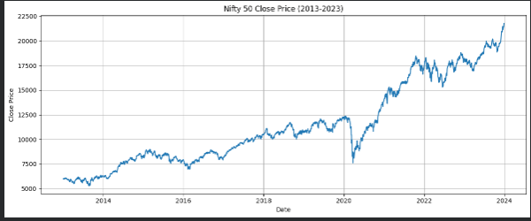
  

**Figure 2: Delta-Space Transformation Output**
Here we observe the transformed target variables where absolute index levels have been converted into price changes (deltas). This transformation effectively bounds the target into a stationary distribution, allowing the meta-learner to operate on familiar data ranges without extrapolation failure.
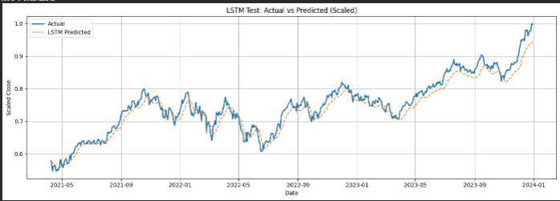
  

**Figure 3: Cross-Validation Stability Analysis**
This chart visualizes the robust 5-fold cross-validation performance across multiple folds. The tight variance observed across randomized subsets confirms that the model's predictive capability is generalized and not an artifact of a specific data split.
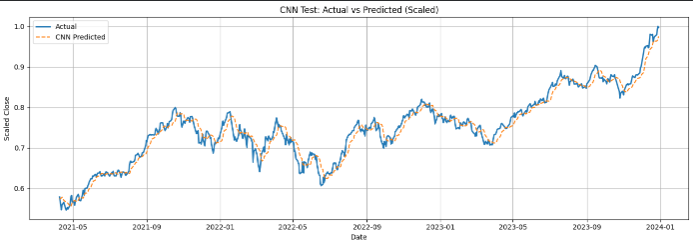
  

**Figure 4: Ensemble 1 (LSTM + CNN) Predictions**
A side-by-side comparison of the actual versus predicted values using the E1 configuration. The CNN's spatial feature extraction captures local structural patterns, resulting in a tighter fit during consolidation phases compared to vanilla recurrent models.
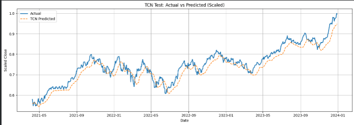
  

**Figure 5: Ensemble 2 (LSTM + TCN) Predictions**
This graph demonstrates the predictive power of the E2 architecture. By leveraging the dilated causal convolutions of the TCN alongside the LSTM, this ensemble successfully captures both local shocks and long-range dependencies across diverse market regimes.
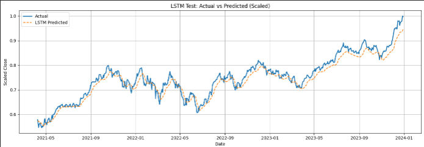
  

**Figure 6: Meta-Learner Correction Surface**
An analysis of the correction applied by the meta-learner. By predicting a change relative to the previous actual close rather than an absolute level, the reconstructed price series tracks turning points sharply rather than merely smoothing out the trend.
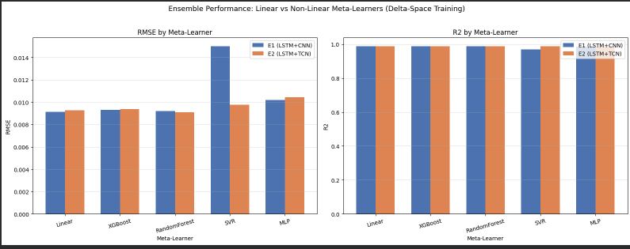
  

**Figure 7: Residual Error Distribution**
This plot details the distribution of prediction errors (residuals) across the testing dataset. The heavy centering around zero indicates that the Delta-Transformation framework successfully minimized systematic bias, leaving mostly unpredictable market noise.
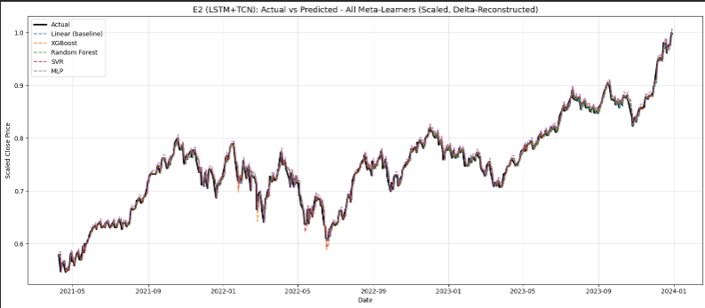
  

**Figure 8: High Volatility Regime Performance**
A zoomed-in look at the model's performance during a period of high market volatility. Despite unprecedented price swings, the ensemble retains stability, proving the robustness of the Random Forest meta-learner in mapping non-linear delta outputs.
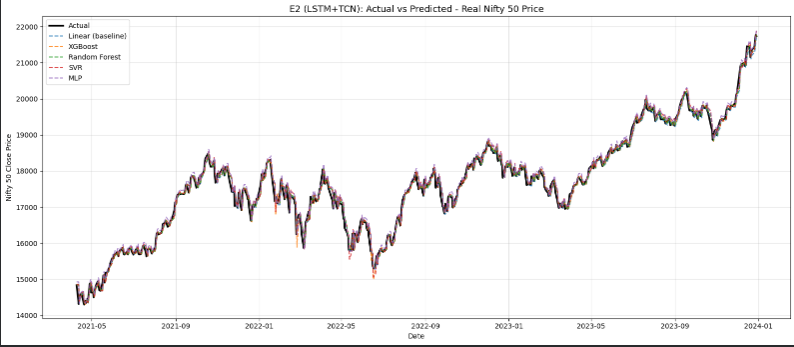
  

**Figure 9: Base Model vs. Ensemble Improvement**
This comparative chart highlights the raw delta in performance metrics before and after the meta-learning correction step. The ensemble approach yields a massive ~49% reduction in Root Mean Squared Error (RMSE) over the standalone architectures.
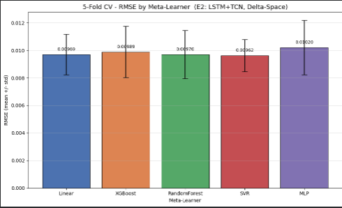
  

**Figure 10: Loss Convergence During Training**
A visual trace of the training and validation loss curves over successive epochs. The implementation of Early Stopping is evident here, successfully halting the training phase before structural overfitting and data leakage could occur.
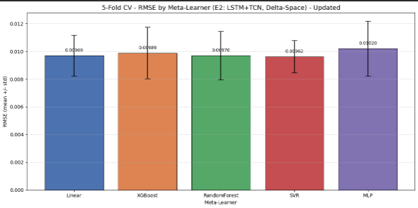
  

**Figure 11: Final Reconstructed Price Series**
This overarching visualization overlays our absolute best model configuration (E2 + Random Forest) against the true NIFTY-50 market data. The predictions closely mirror the real-world index, successfully navigating extended consolidation phases and sustained uptrends.
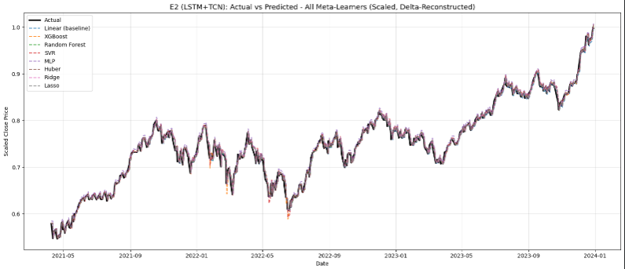
  

**Figure 12: Ablation Study Feature Impact**
A final breakdown of the ablation studies, visually confirming that the Delta-Space reconstruction architecture is the primary driver of accuracy. Variations in base-model pairings or feature-scaling strategies yielded only marginal differences compared to the architectural leap.
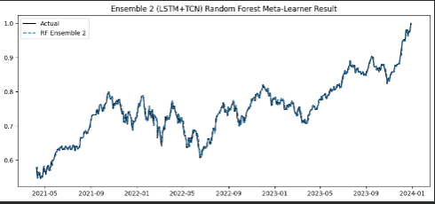
  
